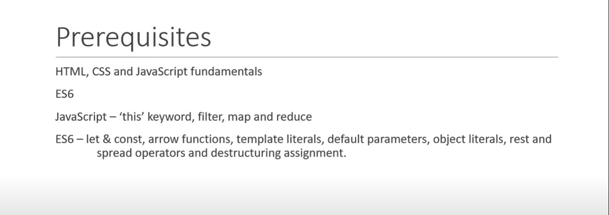
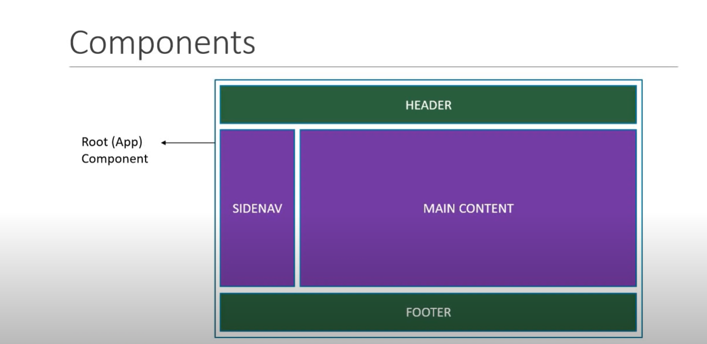
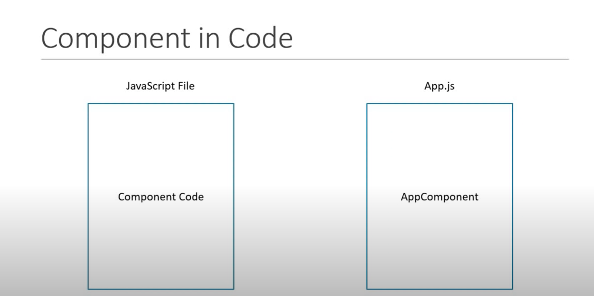
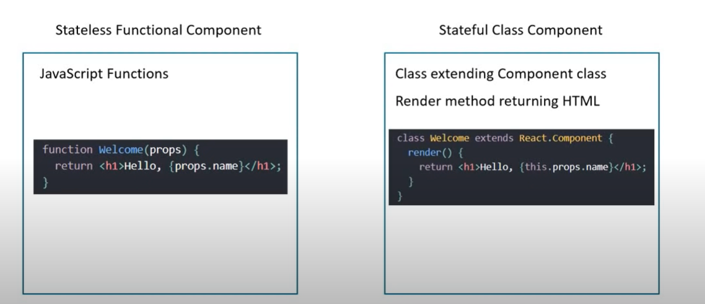

# React Mastery

## Table of Contents

- [React Mastery](#react-mastery)
  - [Table of Contents](#table-of-contents)
  - [Pre Requisites](#pre-requisites)
  - [Installation](#installation)
  - [Components](#components)
    - [Functional Components](#functional-components)
    - [Named Export vs Default Export](#named-export-vs-default-export)


## Pre Requisites


## Content
- Fundamentals
- HTTP
- Routing
- Redux
- Utilities

## Installation

There are multiple ways to install React in your local environment. Here are some of the ways:

1. **Using Create React App**

   Create React App is an officially supported way to create single-page React applications. It offers a modern build setup with no configuration.

```bash
npx create-react-app my-app
cd my-app
npm start
```

2. **Use Vite** - Recommended [Vite](https://vite.dev/guide/)

```bash
npm create vite@latest
```

## Components

Side Nav can be in right side too.


### Component in Code



### Component Types


### Components Summary

- Components describe a part of the UI
- They are reusable and can be nested inside other components
- Two Types
    - Statless Functional Components
    - Stateful Class Components

### Functional Components

Functional components are a simpler way to write components that only contain a render method and don't have their own state. They are JavaScript functions that accept props as an argument and return React elements.

**Key Points**
- Functional components are stateless.
- They are easier to read and test.
- They can use hooks to manage state and side effects.

JS Function optionally receive the properties and returns JSX (HTML)


```bash
//Greet.jsx

import React from 'react'

function Greet() {
  return  <h1>Hello Aashik!</h1>
}

//ES6
const Greet = () => <h1>Hello World</h1>;


export default Greet

//App.jsx
import Greet from './components/Greet'

function App() {
  return (
    <>
      <Greet/>
    </>
  )
}

export default App

``` 

#### Named Export vs Default Export

**Named Export**

* Allows you to export multiple values.
* You must use the same name to import the value.

Example:
```bash
// Greet.jsx
export const Greet = () => <h1>Hello World</h1>;

// App.jsx
import { Greet } from './components/Greet';

function App() {
  return (
    <>
      <Greet />
    </>
  );
}

export default App;
```

**Default Export**
* Allows you to export a single value.
* You can import it with any name.

Example:

```bash
// Greet.jsx
const Greet = () => <h1>Hello World</h1>;
export default Greet;

// App.jsx
import MyComponent from './components/Greet';

function App() {
  return (
    <>
      <MyComponent />
    </>
  );
}

export default App;
```

**Key Points**
- Use named exports when you need to export multiple values from a module.
- Use default exports when a module only exports a single value.