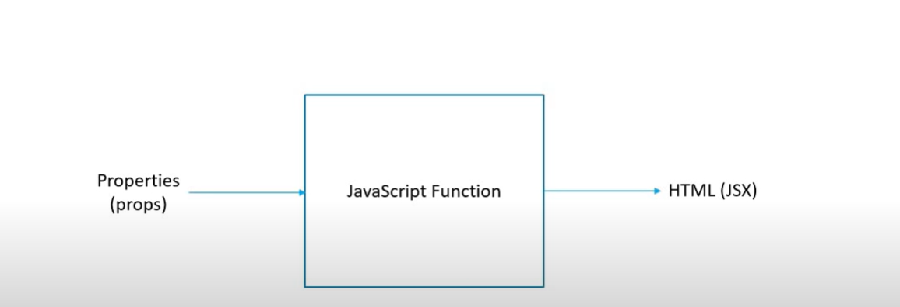
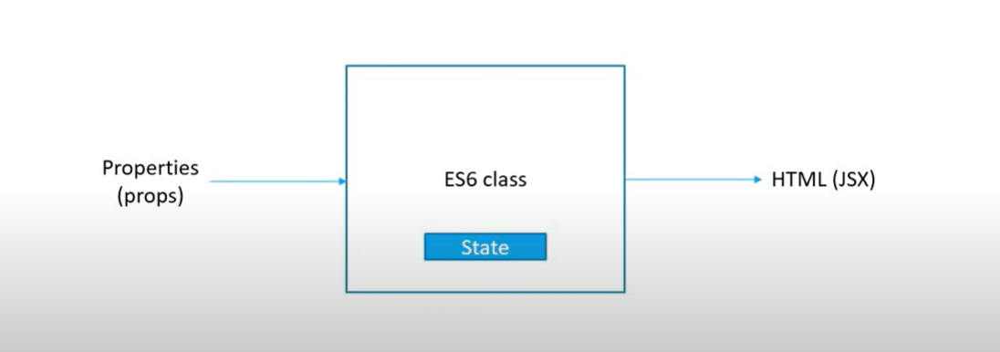
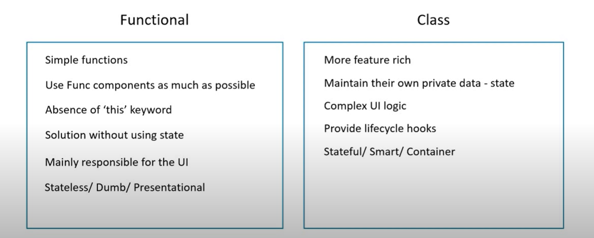
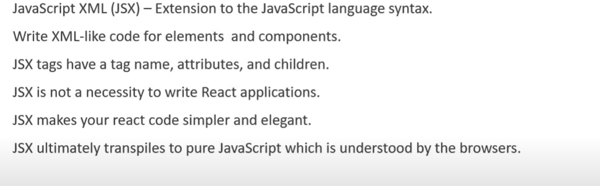
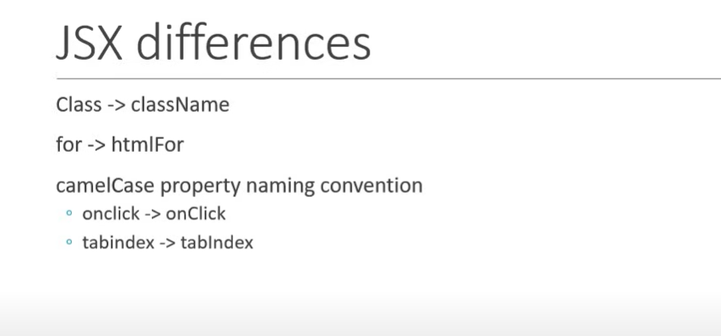

# React Mastery

## Table of Contents

- [React Mastery](#react-mastery)
  - [Table of Contents](#table-of-contents)
  - [Pre Requisites](#pre-requisites)
  - [Installation](#installation)
  - [Components](#components)
    - [Functional Components](#functional-components)
    - [Named Export vs Default Export](#named-export-vs-default-export)
    - [Class Components](#class-components)
    - [Functional vs Class Components](#functional-vs-class-component)
    - [JSX](#jsx)
    - [Propeties aka Props](#props)

## Pre Requisites


## Content
- Fundamentals
- HTTP
- Routing
- Redux
- Utilities

## Installation

There are multiple ways to install React in your local environment. Here are some of the ways:

1. **Using Create React App**

   Create React App is an officially supported way to create single-page React applications. It offers a modern build setup with no configuration.

```bash
npx create-react-app my-app
cd my-app
npm start
```

2. **Use Vite** - Recommended [Vite](https://vite.dev/guide/)

```bash
npm create vite@latest
```

## Components

Side Nav can be in right side too.


### Component in Code


### Component Types


### Components Summary

- Components describe a part of the UI
- They are reusable and can be nested inside other components
- Two Types
    - Statless Functional Components
    - Stateful Class Components

### Functional Components

Functional components are a simpler way to write components that only contain a render method and don't have their own state. They are JavaScript functions that accept props as an argument and return React elements.

**Key Points**
- Functional components are stateless.
- They are easier to read and test.
- They can use hooks to manage state and side effects.

JS Function optionally receive the properties and returns JSX (HTML)



```bash
//Greet.jsx

import React from 'react'

function Greet() {
  return  <h1>Hello Aashik!</h1>
}

//ES6
const Greet = () => <h1>Hello World</h1>;


export default Greet

//App.jsx
import Greet from './components/Greet'

function App() {
  return (
    <>
      <Greet/>
    </>
  )
}

export default App

``` 

#### Named Export vs Default Export

**Named Export**

* Allows you to export multiple values.
* You must use the same name to import the value.

Example:
```bash
// Greet.jsx
export const Greet = () => <h1>Hello World</h1>;

// App.jsx
import { Greet } from './components/Greet';

function App() {
  return (
    <>
      <Greet />
    </>
  );
}

export default App;
```

**Default Export**
* Allows you to export a single value.
* You can import it with any name.

Example:

```bash
// Greet.jsx
const Greet = () => <h1>Hello World</h1>;
export default Greet;

// App.jsx
import MyComponent from './components/Greet';

function App() {
  return (
    <>
      <MyComponent />
    </>
  );
}

export default App;
```

**Key Points**
- Use named exports when you need to export multiple values from a module.
- Use default exports when a module only exports a single value.


### Class Components
Class components are ES6 classes that extend from React.Component and can have their **own state** and lifecycle methods.



```bash
//Welcome.jsx
import React, {Component} from "react";

class Welcome extends Component {
    render(){
        return(
            <h1>Class Component</h1>
        )
    }
}

export default Welcome;

```


#### Functional vs Class Component


But after React 16.7, we can use state in functional components by introducing Hooks.

#### Hooks (Will get back later)
- No breaking changes
- Completely opt-in & 100% backwards-compatible
- Component Types - Functional Component and Class components
- Using state, lifecycle methods and 'this' binding.
- After understanding state, event binding and lifecycle hooks in class components


### JSX 


```bash
//Hello.js
import React from "react";

const Hello = () => {
    // return(
    //     <div>
    //         <h1>Hello, Aashik</h1>
    //     </div>
    // )
    return React.createElement('div', {id: 'hello', className: 'dummyClass'}, React.createElement('h1', null, 'Hello Aashik'));
}

export default Hello;

```



### Update Note on Import React
Q: Why we don't need to import React anymore?
A: 

In React 17 and later, you no longer need to import React to use JSX. This is because the new JSX transform introduced in React 17 automatically imports the necessary functions from the React library behind the scenes.

Explanation
**Before React 17:** You had to import React because JSX was transformed into React.createElement calls.
**React 17 and Later**: The new JSX transform doesn't require React to be in scope, so you don't need to import it explicitly.

Example
**Before React 17**
```bash
import React from 'react';

const Greet = () => <h1>Hello World</h1>;

export default Greet;

```

**React 17 and Later**
```bash
const Greet = () => <h1>Hello World</h1>;

export default Greet;
```

**Key Points**
- The new JSX transform simplifies the code and reduces the need for boilerplate imports.
- You can still import React if you need to use other React features like hooks or context.


### Props
- You can call anything you want that parameter, but the convention is props.
- Props are immutable. READ ONLY.

To pass the unknown content between, simply use ```props.children``` between opening and closing tags.

#### For Functional Component

```bash
//Greet.jsx
const Greet = (props) => {
    return(
        <>
            <h1>Hello, {props.name} a.k.a {props.heroName}</h1>
            {props.children}
        </>
    )
};

export default Greet;

//App.jsx
import Greet from './components/Greet'
function App() {
  return (
    <>
      <Greet name="Bruce" heroName="Batman"> This is children</Greet>
      <Greet name="Clark" heroName="Superman"> <button>Action </button> </Greet>
      <Greet name="Diana" heroName="Wonder Woman"/>
  )
}

export default App
```

#### For Class Component

```bash
//Welcome.jsx

import React, {Component} from "react";

class Welcome extends Component{
    render(){
        return(
            <>
                <h1>Welcome {this.props.name} a.k.a {this.props.heroName}</h1>
                {this.props.children}
            </>
        )
    }
}

export default Welcome;

//App.jsx will be kinda same
```