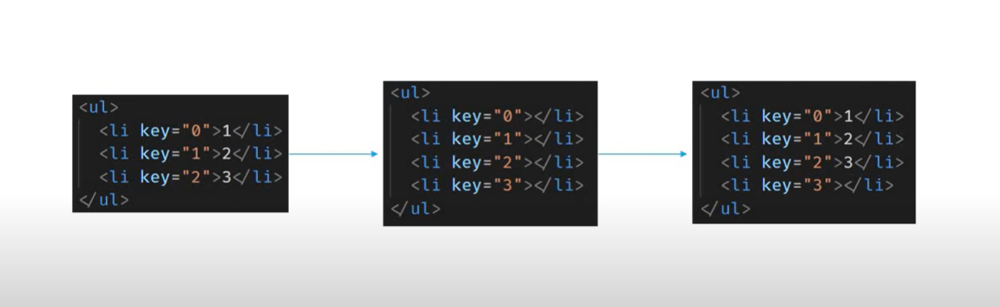

# React Mastery

## Table of Contents

-   [React Mastery](#react-mastery)
    -   [Table of Contents](#table-of-contents)
    -   [Pre Requisites](#pre-requisites)
    -   [Installation](#installation)
    -   [Components](#components)
        -   [Functional Components](#functional-components)
        -   [Named Export vs Default Export](#named-export-vs-default-export)
        -   [Class Components](#class-components)
        -   [Functional vs Class Components](#functional-vs-class-component)
        -   [JSX](#jsx)
        -   [Propeties aka Props](#props)
        -   [State](#state)
        -   [Destructuring Prop and State](#destructuring-prop-and-state)
    -   [Event Handling](#event-handling)
    -   [Event Binding](#event-binding)
    -   [Method as Props](#method-as-props)
    -   [Conditional Rendering](#conditional-rendering)
    -   [List Rendering](#list-rendering)
    -   [Styling and CSS Basics](#styling-and-css-basics)
    -   [Basics of Form Handling](#form-handling) // TODO
    -   [Life Cycle Methods](#life-cycle-methods)
    -   [Hooks](#hooks)

## Pre Requisites


## Content

-   Fundamentals
-   HTTP
-   Routing
-   Redux
-   Utilities

## Installation

There are multiple ways to install React in your local environment. Here are some of the ways:

1. **Using Create React App**

    Create React App is an officially supported way to create single-page React applications. It offers a modern build setup with no configuration.

```bash
npx create-react-app my-app
cd my-app
npm start
```

2. **Use Vite** - Recommended [Vite](https://vite.dev/guide/)

```bash
npm create vite@latest
```

## Components

Side Nav can be in right side too.


### Component in Code


### Component Types


### Components Summary

-   Components describe a part of the UI
-   They are reusable and can be nested inside other components
-   Two Types
    -   Statless Functional Components
    -   Stateful Class Components

### Functional Components

Functional components are a simpler way to write components that only contain a render method and don't have their own state. They are JavaScript functions that accept props as an argument and return React elements.

**Key Points**

-   Functional components are stateless.
-   They are easier to read and test.
-   They can use hooks to manage state and side effects.

JS Function optionally receive the properties and returns JSX (HTML)


```bash
//Greet.jsx

import React from 'react'

function Greet() {
  return  <h1>Hello Aashik!</h1>
}

//ES6
const Greet = () => <h1>Hello World</h1>;


export default Greet

//App.jsx
import Greet from './components/Greet'

function App() {
  return (
    <>
      <Greet/>
    </>
  )
}

export default App

```

#### Named Export vs Default Export

**Named Export**

-   Allows you to export multiple values.
-   You must use the same name to import the value.

Example:

```bash
// Greet.jsx
export const Greet = () => <h1>Hello World</h1>;

// App.jsx
import { Greet } from './components/Greet';

function App() {
  return (
    <>
      <Greet />
    </>
  );
}

export default App;
```

**Default Export**

-   Allows you to export a single value.
-   You can import it with any name.

Example:

```bash
// Greet.jsx
const Greet = () => <h1>Hello World</h1>;
export default Greet;

// App.jsx
import MyComponent from './components/Greet';

function App() {
  return (
    <>
      <MyComponent />
    </>
  );
}

export default App;
```

**Key Points**

-   Use named exports when you need to export multiple values from a module.
-   Use default exports when a module only exports a single value.

### Class Components

Class components are ES6 classes that extend from React.Component and can have their **own state** and lifecycle methods.


```bash
//Welcome.jsx
import React, {Component} from "react";

class Welcome extends Component {
    render(){
        return(
            <h1>Class Component</h1>
        )
    }
}

export default Welcome;

```

#### Functional vs Class Component


But after React 16.7, we can use state in functional components by introducing Hooks.

#### Hooks (Will get back later)

-   No breaking changes
-   Completely opt-in & 100% backwards-compatible
-   Component Types - Functional Component and Class components
-   Using state, lifecycle methods and 'this' binding.
-   After understanding state, event binding and lifecycle hooks in class components

### JSX


```bash
//Hello.js
import React from "react";

const Hello = () => {
    // return(
    //     <div>
    //         <h1>Hello, Aashik</h1>
    //     </div>
    // )
    return React.createElement('div', {id: 'hello', className: 'dummyClass'}, React.createElement('h1', null, 'Hello Aashik'));
}

export default Hello;

```


### Update Note on Import React

Q: Why we don't need to import React anymore?
A:

In React 17 and later, you no longer need to import React to use JSX. This is because the new JSX transform introduced in React 17 automatically imports the necessary functions from the React library behind the scenes.

Explanation
**Before React 17:** You had to import React because JSX was transformed into React.createElement calls.
**React 17 and Later**: The new JSX transform doesn't require React to be in scope, so you don't need to import it explicitly.

Example
**Before React 17**

```bash
import React from 'react';

const Greet = () => <h1>Hello World</h1>;

export default Greet;

```

**React 17 and Later**

```bash
const Greet = () => <h1>Hello World</h1>;

export default Greet;
```

**Key Points**

-   The new JSX transform simplifies the code and reduces the need for boilerplate imports.
-   You can still import React if you need to use other React features like hooks or context.

### Props

-   You can call anything you want that parameter, but the convention is props.
-   Props are immutable. READ ONLY.

To pass the unknown content between, simply use `props.children` between opening and closing tags.

#### For Functional Component

```bash
//Greet.jsx
const Greet = (props) => {
    return(
        <>
            <h1>Hello, {props.name} a.k.a {props.heroName}</h1>
            {props.children}
        </>
    )
};

export default Greet;

//App.jsx
import Greet from './components/Greet'
function App() {
  return (
    <>
      <Greet name="Bruce" heroName="Batman"> This is children</Greet>
      <Greet name="Clark" heroName="Superman"> <button>Action </button> </Greet>
      <Greet name="Diana" heroName="Wonder Woman"/>
  )
}

export default App
```

#### For Class Component

```bash
//Welcome.jsx

import React, {Component} from "react";

class Welcome extends Component{
    render(){
        return(
            <>
                <h1>Welcome {this.props.name} a.k.a {this.props.heroName}</h1>
                {this.props.children}
            </>
        )
    }
}

export default Welcome;

//App.jsx will be kinda same
```

### Props Vs State


### State

#### State change in Class Component

```bash
//Message.jsx
import React, { Component } from 'react'

export class Message extends Component {
    constructor(){
        super(); // bcz we extending Component
        this.state = {
            message: 'Welcome Visitor'
        }

    }

    changeMessage(){
        this.setState({
            message: 'Thank you for subscribing'
        })

    }
  render() {
    return (
      <div>
       <h1>{this.state.message}</h1>
        <button onClick={()=> this.changeMessage()}>Subscribe</button>
      </div>

    )
  }
}

export default Message
```

Note: rconst - for constructor

#### SetState

-   setState is used to update the state in a class component.
-   The component re-renders when the state changes.
-   Never modify the state directly instead use setState to modify

```bash
//Counter.jsx
import React, { Component } from 'react'

class Counter extends Component {
    constructor(props) {
      super(props)

      this.state = {
         count: 0
      }
    }

   increment() {
        // this.setState({
        //     count: this.state.count + 1
        // }, ()=> {console.log('Callback value', this.state.count)})
        // console.log(this.state.count);

        // Using block body with return
        this.setState((prevState) => {
            return { count: prevState.count + 1 };
        });

        // Using implicit return
        this.setState((prevState) => ({
            count: prevState.count + 1
        }));

    }

    incrementFive(){
        this.increment()
        this.increment()
        this.increment()
        this.increment()
        this.increment()
    }
  render() {
    return (
      <div>
        <h1>Counter: {this.state.count}</h1>
        <button onClick={()=> this.incrementFive()}>Increment</button>
        </div>
    )
  }
}

export default Counter

```

```bash
increment() {
        this.setState({
            count: this.state.count + 1
        }, ()=> {console.log('Callback value', this.state.count)})  //1
        console.log(this.state.count); //0

    }
```

Calls to setState are asynchoronous. `console.log(this.state.count)` being called before the state is actually set.
So inorder to call the function after the setState, can use 2nd parameter of the setState as callback function.

`setState(stateObject, callback)`


Note:

```bash
this.setState((prevState)=> { return {count: prevState.count + 1} })

this.setState((prevState)=> ({ count: prevState.count + 1 }))

```

Both of these setState calls are functionally equivalent in terms of updating the state. They both use the functional form of setState to ensure that the state update is based on the previous state. The difference lies in the syntax used to return the new state object.

**Using a Block Body with return**

```bash
this.setState((prevState) => {
  return { count: prevState.count + 1 };
});
```

-   **Syntax:** Uses a block body with an explicit return statement.
-   **Use Case:** Useful when you need to perform additional logic before returning the new state.

**Using an Implicit Return**

```bash
this.setState((prevState) => ({
  count: prevState.count + 1
}));
```

-   **Syntax:** Uses an implicit return with parentheses.
-   **Use Case:** More concise and preferred when the new state object is directly derived from the previous state without additional logic.

### Destructuring Prop and State

#### 1. Destructuring Parameters - Function Comp

```bash
const Greet = ({name, heroName, children}) => {
    console.log(props);
    return(
        <>
            <h1>Hello, {name} a.k.a {heroName}</h1>
            {children}
        </>
    )
};

```

#### 2. Destructuring in the function body - Function Comp

```bash
const Greet = (props) => {
    const { name, heroName } = props;
    return(
        <>
            <h1>Hello, {name} a.k.a {heroName}</h1>
        </>
    )
};

```

#### Destructuring in the function body - Class Comp

```bash
class Welcome extends Component{
    render(){
        const {name, heroName} = this.props;
        //const {state1, state2} = this.state;
        return(
            <>
                <h1>Welcome {name} a.k.a {heroName}</h1>
            </>
        )
    }
}
```

### Event Handling

For Function

-   onClick={clickHandler()} if you call like this, it will call when start and not when clicked

```bash
//FunctionClick.jsx
function FunctionClick() {
    function clickHandler() {
        console.log("Button Clicked");
    }
    return (
        <div>
            <button onClick={clickHandler}>Click</button>
        </div>
    );
}

```

For Class

```bash
//ClassClick.jsx
class ClassClick extends Component {
    clickHandler() {
        console.log("Button Clicked");
    }
    render() {
        return (
            <div>
                <button onClick={this.clickHandler}>Click me</button>
            </div>
        );
    }
}

```

### Event Binding

**M1 - Binding in render method** - performance implications

**M2 - Arrow function in render method** - Still viable optiom=n

```bash
class EventBind extends Component {
    constructor(props) {
        super(props);

        this.state = {
            message: "Hello",
        };
    }

    clickHandler() {
        this.setState({
            message: "Goodbye",
        });
        console.log(this);
    }
    render() {
        return (
            <div>
                <div>{this.state.message}</div>
                //M1
                <button onClick={this.clickHandler.bind(this)}>Click</button>

                //M2
                <button onClick={()=> this.clickHandler()}>Click</button>
            </div>
        );
    }
}
```

**M3 - Binding in the class constructor** - Recommended

-   Since binding happens once in the constructor, this is good compared to M1 and M2 performance wise.

```bash
class EventBind extends Component {
    constructor(props) {
        super(props);

        this.state = {
            message: "Hello",
        };
    }

    clickHandler() {
        this.setState({
            message: "Goodbye",
        });
        console.log(this);
    }
    render() {
        return (
            <div>
                <div>{this.state.message}</div>

                <button onClick={this.clickHandler}>Click</button>
            </div>
        );
    }
}
```

**M4 - Use An arrow function as a class property** - This seems also okay

```bash
class EventBind extends Component {
    constructor(props) {
        super(props);

        this.state = {
            message: "Hello",
        };
    }


    clickHandler = () => {
        this.setState({
            message: "Goodbye",
        });
    };

    render() {
        return (
            <div>
                <div>{this.state.message}</div>
                <button onClick={this.clickHandler}>Click</button>
            </div>
        );
    }
}
```

### Method as Props

Actual idea is we need render parentComponent in App.jsx and ParentComponent will return ChildComponent, when we click(button) that child
component, it need to get the alert message from parentComponent.

```bash
//App.jsx
   return (
        <>
            <ParentComponent />


//ParentComponent.jsx
import ChildComponent from "./ChildComponent";

class ParentComponent extends Component {
    constructor(props) {
        super(props);

        this.state = {
            parentName: "Parent",
        };

        this.greetParent = this.greetParent.bind(this);
    }

    greetParent() {
        alert(`This is from ${this.state.parentName}`);
    }
    render() {
        return (
            <div>
                <ChildComponent greetHandler={this.greetParent} />
            </div>
        );
    }
}

export default ParentComponent;

//ChildComponent.jsx
function ChildComponent(props) {
    return (
        <div>
            {/* <button onClick={() => props.greetHandler()}>Greet Parent</button> */}
            <button onClick={props.greetHandler}>Greet Parent</button>
        </div>
    );
}

export default ChildComponent;

```

### Conditional Rendering

1. if/else
2. Element variables
3. Ternary conditional operator
4. Short circuit operator

#### Using if/else - Not recommended

```bash
class UserGreeting extends Component {
    constructor(props) {
        super(props);

        this.state = {
            isLoggedIn: false,
        };
    }
    render() {
        if (this.state.isLoggedIn) {
            return <div>Welcome Aashik</div>;
        } else {
            return <div>Welcome Guest</div>;
        }
    }
}
```

#### Using element variables

```bash
class UserGreeting extends Component {
    constructor(props) {
        super(props);

        this.state = {
            isLoggedIn: false,
        };
    }
    render() {
        let message;
        if (this.state.isLoggedIn) {
            message = "Welcome Aashik";
        } else {
            message = "Welcome Guest";
        }
        return <div>{message}</div>;
    }
}

```

#### Ternary - Follow most of the time

```bash
class UserGreeting extends Component {
    constructor(props) {
        super(props);

        this.state = {
            isLoggedIn: false,
        };
    }
    render() {
        return this.state.isLoggedIn ? (
            <div>Welcome Aashik</div>
        ) : (
            <div>Welcome Guest</div>
        );
    }
}

```

#### Short circuit - 2nd best option

Based on loggedIn status, either render `Welcome, Aashik` or nothing.

```bash
class UserGreeting extends Component {
    constructor(props) {
        super(props);

        this.state = {
            isLoggedIn: true,
        };
    }
    render() {
        return this.state.isLoggedIn && <div>Welcome Aashik</div>;
    }
}


```

### List Rendering

```bash
function NameList() {
    const names = ["Bruce", "Clark", "Diana"];
    return (
        <div>
            {names.map((name, id) => <h2 key={id}>{name}</h2>)}
        </div>
    );
}

```

if we simplify more,

```bash
function NameList() {
    const names = ["Bruce", "Clark", "Diana"];
    const nameList = names.map((name, id) => <h2 key={id}>{name}</h2>);
    return <div>{nameList}</div>;
}

```

#### For Objects

```bash
//NameList.jsx

function NameList() {
    const persons = [
        {
            id: 1,
            name: "Bruce",
            age: 27,
            skill: "React",
        },
        {
            id: 2,
            name: "Clark",
            age: 26,
            skill: "Angular",
        },
        {
            id: 3,
            name: "Diana",
            age: 22,
            skill: "Vue",
        },
    ];
    const personList = persons.map((person, id) => (
        <h2 key={id}>
            I'm {person.name}. I'm {person.age} years old. I know {person.skill}
        </h2>
    ));
    return <div>{personList}</div>;
}

export default NameList;

```

Refactor more,

```bash
//NameList.jsx

function NameList() {
    const persons = [
        {
            id: 1,
            name: "Bruce",
            age: 27,
            skill: "React",
        },
        {
            id: 2,
            name: "Clark",
            age: 26,
            skill: "Angular",
        },
        {
            id: 3,
            name: "Diana",
            age: 22,
            skill: "Vue",
        },
    ];
    const personList = persons.map((person) => (
        <Person person={person} key={person.id} />
    ));
    return <div>{personList}</div>;
}


//Person.jsx
function Person({ person, id }) {
    return (
        <h2 key={id}>
            I'm {person.name}. I'm {person.age} years old. I know {person.skill}
        </h2>
    );
}

```

### Keys and List

Keys are a crucial part of React's reconciliation process. They help React identify which items have changed, are added, or are removed. This improves the performance of rendering lists by allowing React to re-render only the changed elements

-   Keys in React are used to identify elements in a list.
-   They help React optimize the rendering process by identifying which items have changed, are added, or are removed.
-   Help in efficient update of the user interface
-   Keys should be unique among siblings and consistent across renders.
-   Using array indices as keys is not recommended if the list can change.
-   Cannot pass prop as key, if we need to pass, need to pass as different name.


### Index as Key Anti-pattern

Use index as the 2nd parameter of the arrow function.

```bash
function NameList() {
    const names = ["Bruce", "Clark", "Diana"];
    nameList = names.map((name, index) => <h2 key={index}> {index} {name}</h2>);

    return <div>{nameList}</div>;
}

export default NameList;

```

**Disaster in this certain scenarios**

When adding item in the beginning in the list.


and also the problem when trying to sort the list


##### When to use index as a key

1. The items in your list do not have a unique id
2. The list is a static list and will not change
3. The list will never be reordered or filtered

**If not** try these methods

-   Generate a uniqueID using uuid
-   Hashing out the unique id from one of the existing properties

### Styling and CSS Basics

1. CSS Stylesheets
2. Inline styling
3. CSS Modules
4. CSS in JS Libraries (Styled components) - For projects

#### CSS Stylesheets

CSS stylesheets can be used in any child component. However, it might lead to some conflicts due to the global nature of CSS. To avoid conflicts, consider using CSS Modules or styled-components.

**Key Points**

-   **Global Scope:** CSS styles are global by default, which can lead to conflicts if multiple components use the same class names.
-   **CSS Modules:** Consider using CSS Modules to scope CSS locally to the component.
-   **Styled-Components:** Another alternative is to use styled-components for scoped styling.

```css
.primary {
    color: orange;
}

.font-xl {
    font-size: 72px;
}
```

```jsx
function Stylesheet(props) {
    let className = props.primary ? "primary" : "";
    return (
        <div>
            <h1 className={`${className} font-xl`}>Stylesheet</h1>
        </div>
    );
}
```

#### Inline styling

```bash
function Inline() {
    const heading = {
        fontSize: "72px",
        color: "blue",
    };

    return (
        <div>
            <h1 style={heading}>Inline</h1>
        </div>
    );
}
```

#### CSS Modules

Available with react-scripts: 2.0 or higher

Naming convention: **name.module.css**
Import convention: `import styles from "path/to/styles"`

Using CSS Modules or styled-components helps to avoid conflicts and keeps styles scoped to the component.

#### CSS in JS Libraries

CSS-in-JS libraries, such as styled-components, allow you to write CSS directly within your JavaScript code. This approach provides several benefits, including scoped styles, dynamic styling, and easier maintenance.

##### Benefits of Styled Components

1. **Scoped Styles**: Styles are scoped to the component, preventing conflicts with other components.
2. **Dynamic Styling**: You can use JavaScript to dynamically change styles based on props or state.
3. **Maintainability**: Styles are colocated with the component, making it easier to maintain and understand the code.
4. **Theming**: Styled-components support theming, allowing you to define a consistent look and feel across your application.

##### Example of Using Styled Components

1. **Install Styled Components**
    ```bash
    npm install styled-components
    ```

```jsx
// Button.jsx
import React from "react";
import styled from "styled-components";

const StyledButton = styled.button`
    background-color: ${(props) => (props.primary ? "blue" : "gray")};
    color: white;
    padding: 10px 20px;
    border: none;
    border-radius: 5px;
    cursor: pointer;

    &:hover {
        background-color: ${(props) =>
            props.primary ? "darkblue" : "darkgray"};
    }
`;

function Button({ primary, children }) {
    return <StyledButton primary={primary}>{children}</StyledButton>;
}

export default Button;

// App.jsx
import React from 'react';
import Button from './Button';

function App() {
  return (
    <div>
      <Button primary>Primary Button</Button>
      <Button>Secondary Button</Button>
    </div>
  );
}

export default App;
```

### Form Handling

### Life Cycle Methods

React components have several lifecycle methods that you can override to run code at specific times in the process of a component's life. These methods are divided into three main phases: Mounting, Updating, and Unmounting.

#### Mounting

These methods are called when an instance of a component is being created and inserted into the DOM.

1. **constructor(props)**

    - Called before the component is mounted.
    - Used for initializing state and binding event handlers.

2. **static getDerivedStateFromProps(props, state)**

    - Called right before rendering the element(s) in the DOM.
    - Used to update the state based on props.

3. **render()**

    - The only required method in a class component.
    - Returns the JSX to be rendered.

4. **componentDidMount()**
    - Called after the component is mounted.
    - Used for side effects like fetching data from an API.

#### Updating

These methods are called when a component is being re-rendered as a result of changes to props or state.

1. **static getDerivedStateFromProps(props, state)**

    - Called right before rendering the element(s) in the DOM.
    - Used to update the state based on props.

2. **shouldComponentUpdate(nextProps, nextState)**

    - Called before rendering when new props or state are received.
    - Used to optimize performance by preventing unnecessary re-renders.

3. **render()**

    - Returns the JSX to be rendered.

4. **getSnapshotBeforeUpdate(prevProps, prevState)**

    - Called right before the DOM is updated.
    - Used to capture some information from the DOM before it changes.

5. **componentDidUpdate(prevProps, prevState, snapshot)**
    - Called after the component is updated.
    - Used for side effects like fetching data based on updated props.

#### Unmounting

This method is called when a component is being removed from the DOM.

1. **componentWillUnmount()**
    - Called right before the component is unmounted and destroyed.
    - Used for cleanup like cancelling network requests or removing event listeners.

### Example of Lifecycle Methods

```javascript
import React, { Component } from "react";

class LifeCycleDemo extends Component {
    constructor(props) {
        super(props);
        this.state = { data: null };
        console.log("Constructor");
    }

    static getDerivedStateFromProps(props, state) {
        console.log("getDerivedStateFromProps");
        return null;
    }

    componentDidMount() {
        console.log("componentDidMount");
        // Simulate a data fetch
        setTimeout(() => {
            this.setState({ data: "Fetched Data" });
        }, 1000);
    }

    shouldComponentUpdate(nextProps, nextState) {
        console.log("shouldComponentUpdate");
        return true;
    }

    getSnapshotBeforeUpdate(prevProps, prevState) {
        console.log("getSnapshotBeforeUpdate");
        return null;
    }

    componentDidUpdate(prevProps, prevState, snapshot) {
        console.log("componentDidUpdate");
    }

    componentWillUnmount() {
        console.log("componentWillUnmount");
    }

    render() {
        console.log("Render");
        return <div>{this.state.data ? this.state.data : "Loading..."}</div>;
    }
}

export default LifeCycleDemo;
```

**Key Points**

-   **Mounting:** Methods called when a component is created and inserted into the DOM.
-   **Updating:** Methods called when a component is re-rendered due to changes in props or state.
-   **Unmounting:** Method called when a component is removed from the DOM.

### Hooks

1. useState
2. useEffect
3. useContext
4. useRef
5. useReducer
6. useCallback
7. useMemo

#### useState

The React useState Hook allows us to track state in a function component.

State generally refers to data or properties that need to be tracking in an application.

useState accepts an initial state and returns two values:

-   The current state.
-   A function that updates the state.

Notice that again, we are destructuring the returned values from useState.

The first value, color, is our current state.

The second value, setColor, is the function that is used to update our state.

Lastly, we set the initial state to an empty string: useState("")

```jsx
import React, { useState } from "react";

function FavouriteColor() {
    const [color, setColor] = useState("red");

    return (
        <div>
            <h1>My Favourite Color is {color}!</h1>
            <button onClick={() => setColor("blue")}>Blue</button>
        </div>
    );
}

export default FavouriteColor;
```

The useState Hook can be used to keep track of strings, numbers, booleans, arrays, objects, and any combination of these!

We could create multiple state Hooks to track individual values

```jsx
function Car() {
    const [brand, setBrand] = useState("Ford");
    const [model, setModel] = useState("Mustang");
    const [year, setYear] = useState("1964");
    const [color, setColor] = useState("red");
    return (
        <div>
            <h1>My {brand}</h1>
            <p>
                It is a {color} {model} from {year}
            </p>
        </div>
    );
}

export default Car;
```

Or, we can just use one state and include an object instead!

```jsx
function Car() {
    const [car, setCar] = useState({
        brand: "Ford",
        model: "Mustang",
        year: "1964",
        color: "red",
    });
    // const { brand, model, year, color } = car; // No need to use car.brand
    return (
        <div>
            <h1>My {car.brand}</h1>
            <p>
                It is a {car.color} {car.model} from {car.year}
            </p>
        </div>
    );
}
```

##### Updating Objects and Arrays in State

When state is updated, the entire state gets overwritten.
What if we only want to update the color of our car?

If we only called setCar({color: "blue"}), this would remove the brand, model, and year from our state.

We can use the JavaScript spread operator to help us.

```jsx
function Car() {
    const [car, setCar] = useState({
        brand: "Ford",
        model: "Mustang",
        year: "1964",
        color: "red",
    });
    // const { brand, model, year, color } = car; // No need to use car.brand
    const updateColor = () => {
        setCar((prevState) => ({
            ...prevState,
            color: "blue",
        }));
    };
    return (
        <div>
            <h1>My {car.brand}</h1>
            <p>
                It is a {car.color} {car.model} from {car.year}
            </p>
            <button onClick={updateColor}>Blue</button>
        </div>
    );
}
```

Because we need the current value of state, we pass a function into our setCar function. This function receives the previous value.
We then return an object, spreading the previousState and overwriting only the color.
